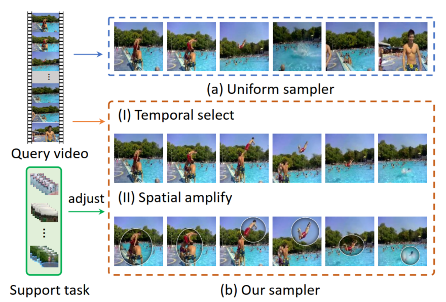
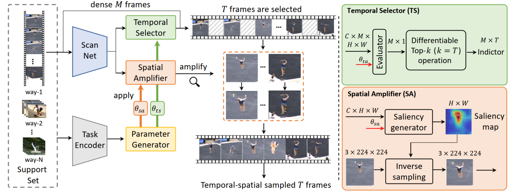

# Task-adaptive Spatial-Temporal Video Sampler for Few-shot Action Recognition

Please refer to https://arxiv.org/abs/2207.09759 for this paper.

## Introduction
<div align="center">
<br/>
</div>
A uniform sampler may overlook frames containing key actions. Critical regions involving the actors and objects may be too small to be properly recognized. (b) Our sampler can (I) select frames from an entire video that contribute most to few-shot recognition, (II) amplify discriminative regions in each frame. This sampling strategy is also dynamically adjusted for each video according to the episode task at hand.

## Overview

<div align="center">
<br/>
</div>


## Todo

- [x] Realease the ActivityNet dataset few-shot split file.
- [x] Realease the core part of Sampler.
- [ ] Code of Sampler + ProtoNet.
- [ ] Realease the whole training and inference code.
- [ ] Sampler + TA2N/TRX/OTAM.


## Bibtex
If you find our work helpful for your research, please consider citing the following BibTeX entry.

```bibtex
@inproceedings{liu2022task,
  title={Task-adaptive Spatial-Temporal Video Sampler for Few-shot Action Recognition},
  author={Liu, Huabin and Lv, Weixian and See, John and Lin, Weiyao},
  booktitle={Proceedings of the 30th ACM International Conference on Multimedia},
  pages={6230--6240},
  year={2022}
}
```

## Contact

Please feel free to contact huabinliu@sjtu.edu.cn if you have any questions.

